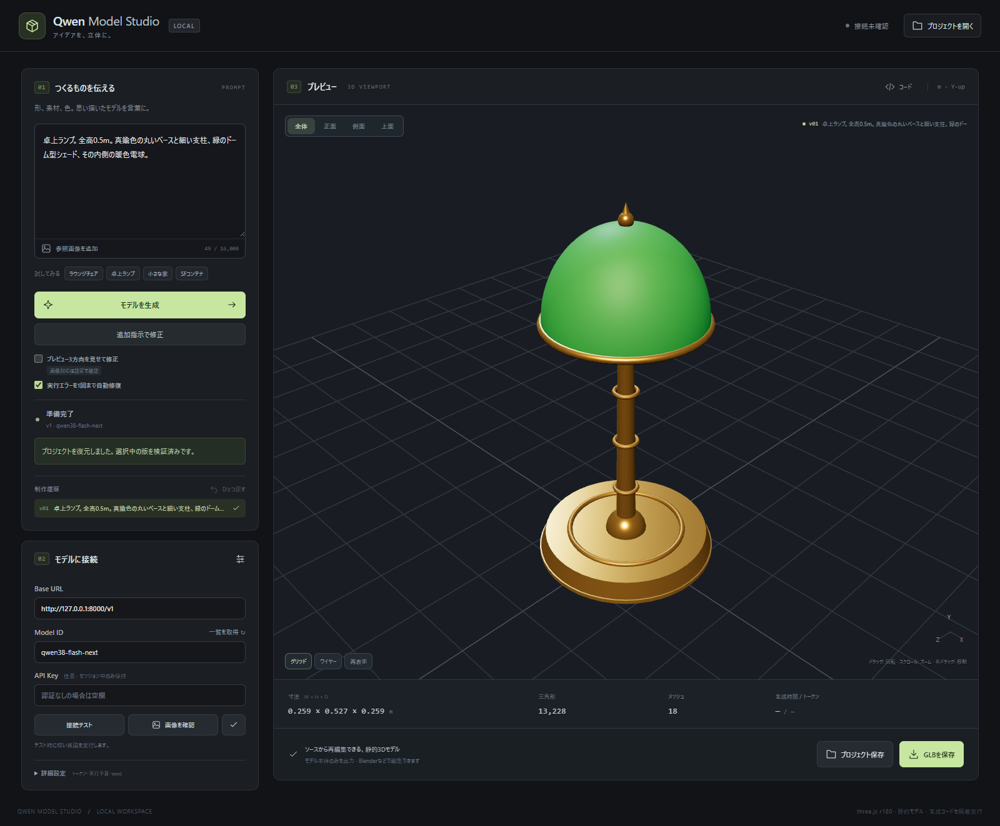
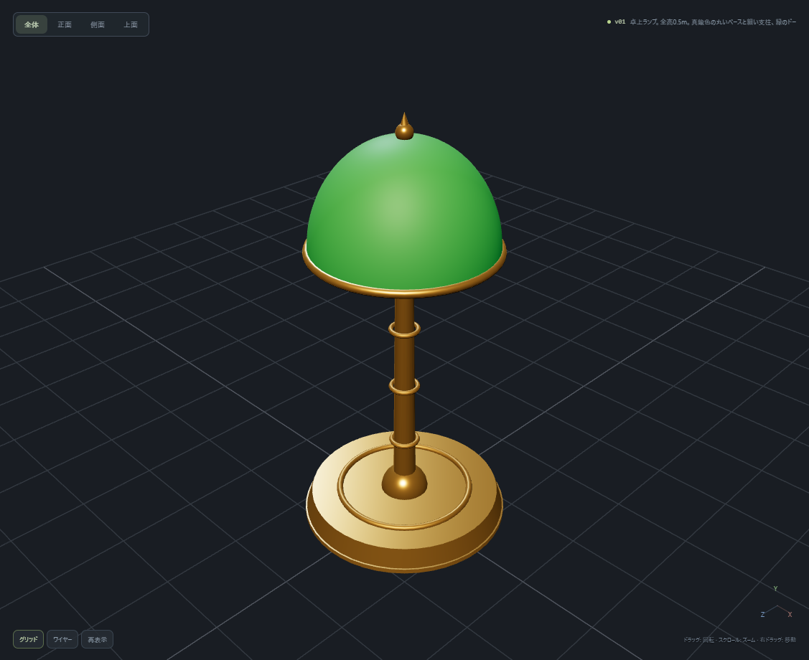
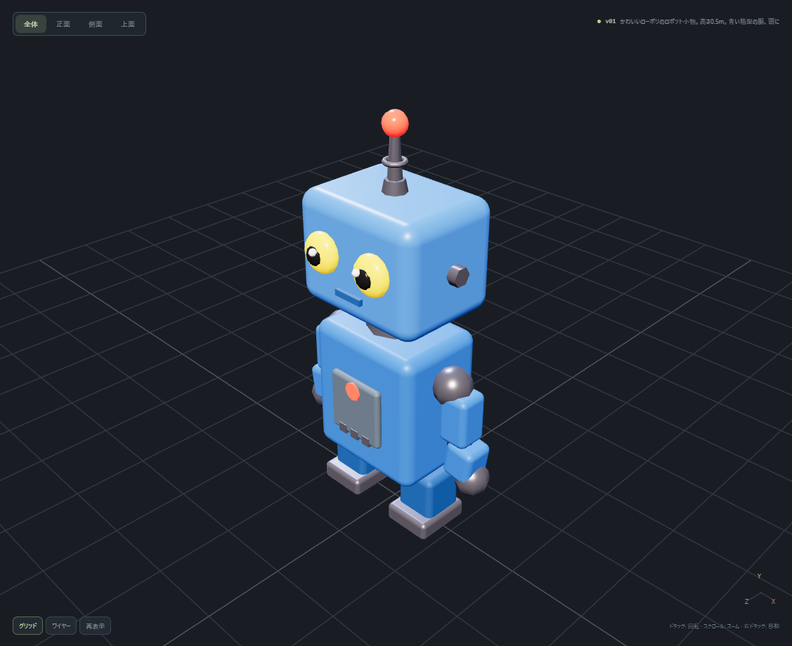
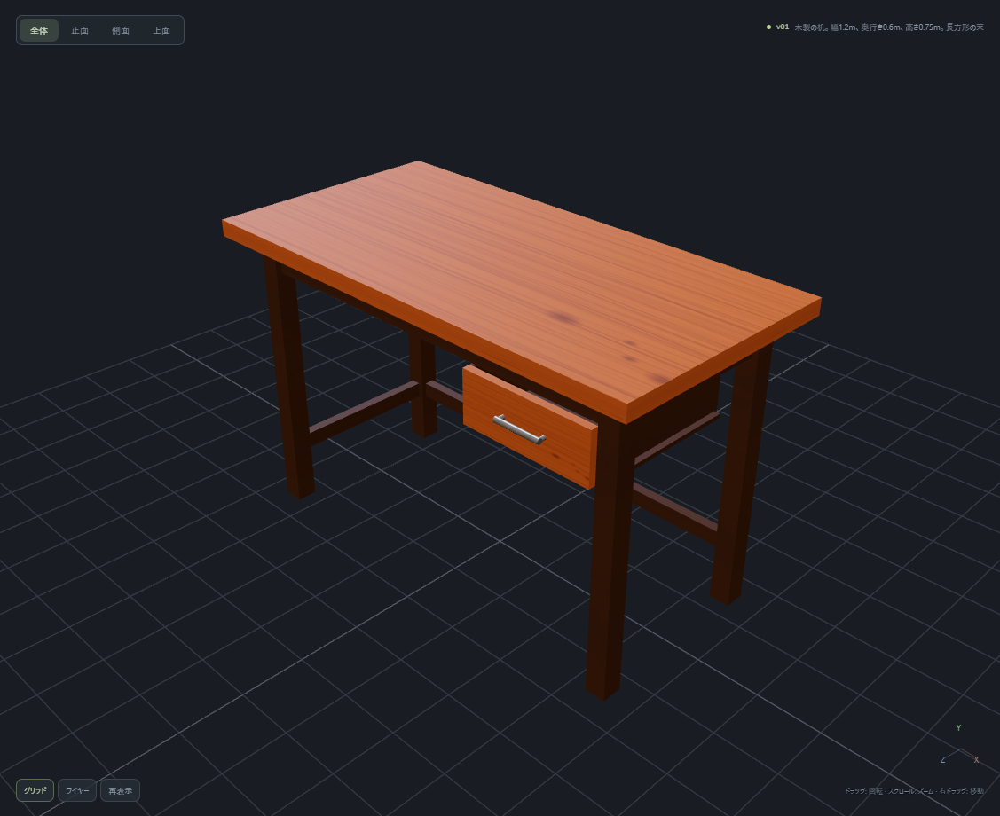
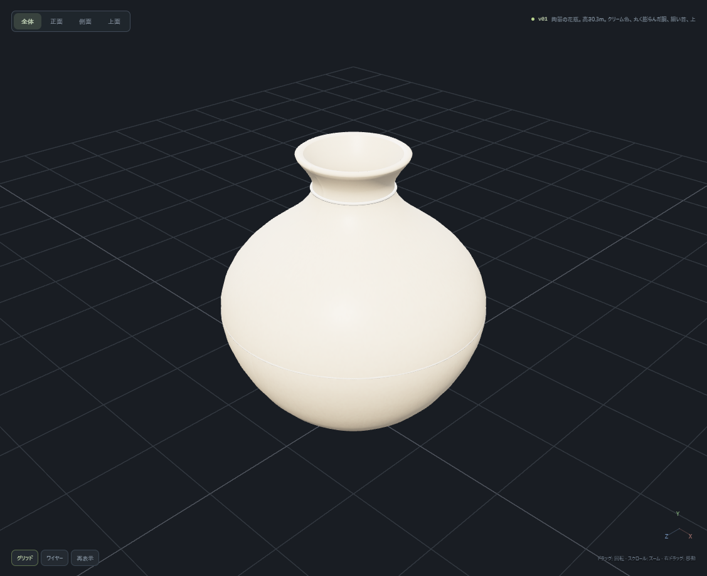

# Qwen Model Studio

**自然文から3Dモデルを作り、確認・修正してGLBで保存するローカルアプリ。**

A local three.js modeling studio powered by an OpenAI-compatible LLM server. Generate JavaScript models, inspect them in 3D, revise them, and export GLB. Japanese UI. MIT licensed.

React / TypeScript / three.js / Node.js · **v0.1.0 — experimental**



保存済みのベンチマーク作品をアプリで復元した画面です。

## できること

- 自然文と参照画像からthree.jsコードを生成し、3Dプレビューで確認。
- 追加指示による修正、正面・側面・斜めの画像を添付する修正、履歴20版と「ひとつ戻す」。
- 回転・移動・ズーム、正面／側面／上面、グリッド・ワイヤーフレーム。
- GLBの保存と自動再読込検査、ソース・履歴を含む `.qmodel` の保存・復元。
- API設定、接続・画像入力の簡易テスト、停止、最大1回の自動修復。
- 推論なしで使える、寸法・テクスチャ・階層を確認する校正モデル。

形状を固定スキーマに制限せず、関数、数式、ループ、任意のBufferGeometry、曲線、押し出し、回転体、手続き的テクスチャを使えます。Blenderは不要です。

## 生成例

ベンチマークで生成した作品の抜粋です。すべて実際の3Dプレビューを撮影しています。

| 緑のシェードと真鍮の卓上ランプ                    | ローポリのロボット                               |
| ------------------------------------------------- | ------------------------------------------------ |
|      |  |
| 木目のあるデスク                                  | 陶器の花瓶                                       |
|  |   |

[撮影元・条件](docs/images/README.md) / [全体の評価結果](POC_REPORT.md)

## 動作環境

- **Node.js 22.12以降の22系、または24以上**、npm。
- WebGL2とWorkerのOffscreenCanvasに対応したChrome / Edge。実機検証はWindows + Chrome。
- `/v1/models` と `/v1/chat/completions` に対応する推論サーバー。画像機能には画像入力対応モデルも必要。

モデル本体や推論サーバーは同梱しません。接続実績はQwen3.8-Flash-Nextを配信するvLLMです。他のOpenAI互換サーバーは、API形式に加えてコード生成・画像入力への対応を個別に確認してください。macOS / Linuxは未検証です。

## 起動

取得したソースのルートで実行します。

```sh
npm ci
npm run build
npm start
```

[http://127.0.0.1:4173](http://127.0.0.1:4173) をブラウザで開きます。Windowsでは `start.cmd` のダブルクリックでも起動できます。初回は依存パッケージを取得し、毎回ビルドします。終了はコンソールで `Ctrl+C`。

1. **Base URL**に自分の推論先を入力します。初期値 `http://127.0.0.1:8000/v1` は例で、サーバーを起動する設定ではありません。
2. 「一覧を取得」でModel IDを選択するか、配信名を直接入力します。認証が必要な場合はAPIキーも設定します。
3. 「設定を保存」「接続テスト」を実行します。
4. 形・部品・素材・寸法を入力して「モデルを生成」。必要に応じて追加指示で修正します。
5. 完成したら「GLBを保存」。あとで再編集する場合は「プロジェクト保存」も使います。

APIキーはサーバープロセスのメモリだけに保持します。再起動後は再入力が必要です。キーを除く接続設定は `.local/settings.json`、作品履歴はページのメモリに保存します。ページを閉じる前に必要なプロジェクトを保存してください。

## 現状の品質と制限

初期30件の実測では、初回28/30、最大1回修復後29/30が表示・GLB検査を通過し、主要な形状条件は25/30が充足しました。採用したv2プロンプトの追加評価は16/16が初回有効、13/16が主要条件を充足しました。対象を絞った追加評価なので、比率をそのまま比較することはできません。

**GLBが正常に保存できても、形状・寸法が正しいとは限りません。** ガラスの埋没、部材の位置、アーチの向き、指示寸法の超過などが残ります。画像付き修正のUIは実装済みですが、実機での複数方向画像による修正品質評価は未完了です。

生成コードは隔離Workerで実行します。CPUの無限ループは停止できますが、OSレベルのメモリ上限やGPUプロセスの完全隔離はありません。単一ユーザーのローカル利用向けで、公開サーバーとしての運用は対象外です。

静的なメッシュモデルが対象です。製造用CAD、水密性、四角面主体のトポロジー、リグ、アニメーション、独自シェーダーの自動ベイクは提供しません。

## ドキュメント

| 読みたい内容                              | 文書                                                                             |
| ----------------------------------------- | -------------------------------------------------------------------------------- |
| 実装済み機能・上限・ファイル形式          | [仕様書](docs/SPECIFICATION.md)                                                  |
| API接続・Qwen設定・エラー対処             | [設定とトラブルシュート](docs/CONFIGURATION.md)                                  |
| コンポーネント・データフロー・ローカルAPI | [アーキテクチャ](docs/ARCHITECTURE.md)                                           |
| 実測値・評価方法・未完了事項              | [PoCレポート](POC_REPORT.md) / [プロンプト調整レポート](PROMPT_TUNING_REPORT.md) |
| 開発・テスト・ソース配布                  | [開発ガイド](docs/DEVELOPMENT.md)                                                |
| 貢献・バグ報告                            | [CONTRIBUTING.md](CONTRIBUTING.md)                                               |
| 隔離の範囲・機密情報・脆弱性報告          | [SECURITY.md](SECURITY.md)                                                       |
| 変更履歴                                  | [CHANGELOG.md](CHANGELOG.md)                                                     |
| 依存ライセンス                            | [依存一覧](docs/DEPENDENCIES.md) / [第三者通知](THIRD_PARTY_NOTICES.md)          |

## 開発

公開前のビルド・テスト・依存監査の結果は [公開準備の確認記録](docs/RELEASE_STATUS.md) にまとめています。

```sh
npm run dev
npm test
```

E2Eは別コンソールでアプリを起動して `npm run test:e2e`。インストール済みのGoogle Chromeを使い、推論APIはモックします。実WSのベンチマークは明示的に `npm run evaluate` を実行したときだけ行います。詳しくは開発ガイドを参照してください。

## 注意事項

想定・主な検証対象モデルはQwen3.8-Flash-Next（served model ID: qwen38-flash-next）です。システムプロンプトおよび採用済みv2プロンプトのチューニングも、このモデルを主対象に行っています。他のモデルでの動作や生成品質は保証しません。

## ライセンス

このプロジェクトのソースコードと文書は [MIT License](LICENSE) です。著作権表記は `Qwen Model Studio contributors` としています。[MITの標準条文](https://opensource.org/license/mit)を使用しています。

依存ライブラリには各ライセンスが適用されます。モデルの重み、推論サービス、第三者の入力画像には本プロジェクトのMITライセンスを適用しません。生成した作品の利用は、利用モデル・サービスの条件と入力素材の権利を確認してください。

本プロジェクトは独立した実装で、Qwen、Alibaba、OpenAIの公式製品ではありません。
