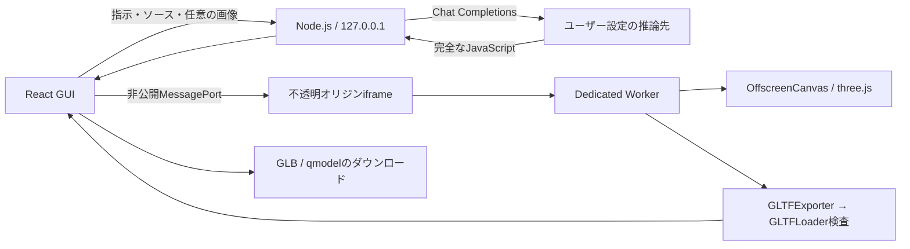

# アーキテクチャ

## データフロー

## 主なファイル

| 場所                            | 責務                                                      |
| ------------------------------- | --------------------------------------------------------- |
| `src/main.tsx`                  | 操作、設定、生成状態、履歴、候補版の採用                  |
| `src/runtime.ts`                | iframe、Worker、非公開MessagePort、期限、破棄             |
| `runtime/worker.js`             | 生成コード実行、形状検査、描画、撮影、GLB出力・再読込     |
| `src/project.ts`                | qmodelの保存・検証・復元                                  |
| `server/index.mjs`              | 同一オリジン・セッション確認、設定、単一ジョブ、APIルート |
| `server/upstream.mjs`           | 上流HTTP、APIキー付加、サイズ制限、期限、エラー変換       |
| `server/prompt.mjs`             | システムプロンプト、ソース・画像を含むメッセージ構築      |
| `shared/config.mjs`             | three.js / addons固定値、設定の初期値・検証               |
| `shared/source.mjs`             | 完全応答の確認、エントリーポイント抽出                    |
| `tests/fixtures/calibration.js` | APIなしで再現する非対称校正モデル                         |

## ジョブとモデルの寿命

ローカルAPIは同時に1つの上流ジョブだけを許可し、設定変更も処理中は拒否します。APIキーはNode.jsのメモリに保持します。

UIは完全なコードを受け取ってから候補Workerを作成します。候補の実行・検査・GLB再読込が成功した時点で採用し、古いモデルのGeometry、Material、TextureとWorkerを解放します。候補が失敗した場合は現行版を保持します。ダウンロード用Object URLも解放します。

実行にはFunctionを使いますが、Function自体は隔離手段ではありません。Workerは `sandbox="allow-scripts"` の不透明オリジンiframeが所有し、CSPとオリジン分離を併用します。実行期限を生成コードの外側から管理します。残る制約は [SECURITY.md](../SECURITY.md) に記載しています。

## ローカルAPI

外部公開用の安定APIではありません。`GET /api/session` 以外は `X-Session-Token` が必要で、Host、Origin、Fetch Metadataも確認します。

| メソッド / パス      | 入力                                        | 出力・用途                                                 |
| -------------------- | ------------------------------------------- | ---------------------------------------------------------- |
| `GET /api/session`   | なし                                        | セッション、公開設定、キー有無、画像テスト結果、promptHash |
| `PUT /api/settings`  | 設定一式、任意のapiKey                      | 検証・保存した設定。apiKey空文字は削除                     |
| `POST /api/models`   | `{}`                                        | 上流のモデル一覧                                           |
| `POST /api/test`     | `{}` またはPNG data URLのimage              | 短い応答、時間、使用トークン、画像確認結果                 |
| `POST /api/generate` | prompt、seed、任意のsource / images / error | 完全なsource、モデル名、時間、使用トークン                 |
| `POST /api/cancel`   | `{}`                                        | 進行中の上流リクエストを中止                               |

エラーはJSONの `error` と `code` で返します。認証・レート制限・通信・タイムアウト・形式・未完了・実行契約の違反を区別します。完全な契約違反ソースは、1回の修復のため `details.rejectedSource` に返すことがあります。修復応答の部分編集はサーバーが指定行の元テキストと照合して適用し、完成したソースを返します。編集形式や照合が不正な場合は `patch` エラーにします。プロバイダーのreasoning本文はUIへ返しません。

上流は `/models` と `/chat/completions` を使い、生成時は `stream: false` です。独自のサーバー起動、モデル管理、学習は行いません。
